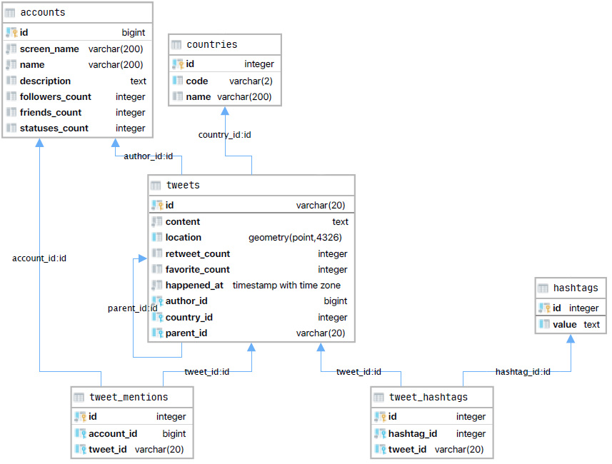

# Tweets data

This tool processes `zipped` files in `.jsonl` format containing tweets' data. (The tool is configured to process all data files with the suffix `.jsonl.gz` in the `./data` directory)

Official documentation of the tweet json can be found here [here](https://developer.twitter.com/en/docs/twitter-api/v1/data-dictionary/overview/tweet-object).

## Elastic search import

TODO

## PosgreSQL import

All the logic for this import is inside the `Postgres` module.
The data can be imported to a `PostgreSQL` database according to the following model:

